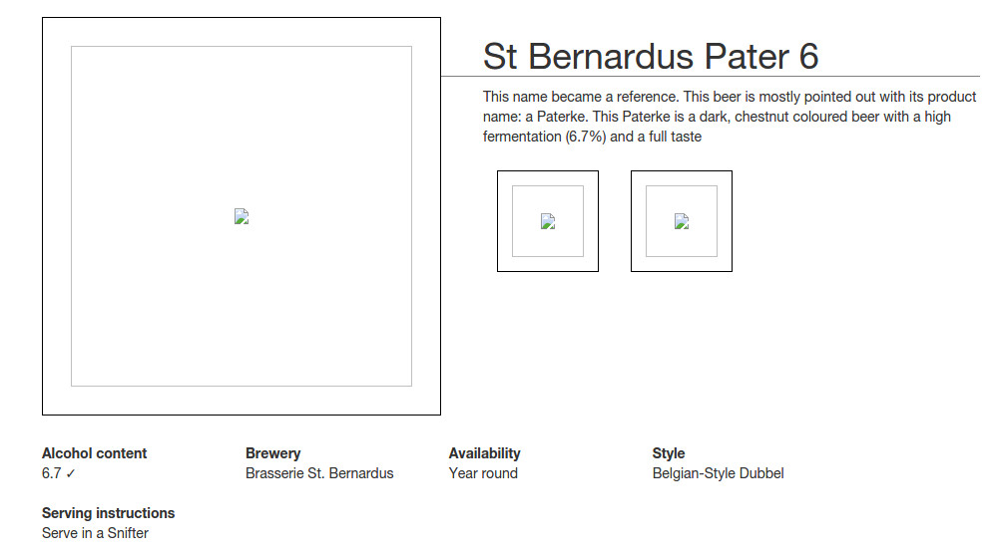

# Step 05 - Beer details

## Let's restore beer details 

Right now we haven't got the beers details yet, the JS app looks for the individual JSON files in the beers directory. A quick fix would be to put the JSON files for each beer inside `/static/beers`. Let's begin by doing it...

Now we have most of the beer details but images are missing. We must modify JSON files to indicate that images are inside `/images` path (the `/static/images/` directory in the project).

## Let's put the beer details inside the database

To make things cleaner we should get rid of those JSON files and put the information in the database. The simplest way to do is is to modify the `beer` table definition adding all the fields of the beet details.

Let's begin by adding the new properties to the `Beer` class:

`Beer.java`:

		/*
		 ...
		 */

		private String availability;
		private String brewery;
		private String label;
		private String serving;
		private String style;
		

Then we can rewrite the table initialization in `BeerInitialize.java`:

`BeerInitialize.java`:

		/*
		 ...
		 */
		 
		stmt.executeUpdate("CREATE TABLE beers ( id varchar(50), name varchar(100)," 
				+"image varchar(100), description varchar(1000), alcohol decimal(3,1),"
				+"availability varchar(100), brewery varchar(200), label varchar(100)," 
				+"serving varchar(200), style  varchar(200))");
		
		// prepared statement
		PreparedStatement prep = conn
					.prepareStatement("INSERT INTO beers (id, name, image, description, alcohol," 
							+"availability, brewery, label, serving, style)"
							+"VALUES (?,?,?,?,?,?,?,?,?,?)");

		for (Beer beer : BeerInitialize.getBeers()) {
			prep.setString(1, beer.getId());
			prep.setString(2, beer.getName());
			prep.setString(3, beer.getImg());
			prep.setString(4, beer.getDescription());
			prep.setDouble(5, beer.getAlcohol());
			prep.setString(6, beer.getAvailability());
			prep.setString(7, beer.getBrewery());
			prep.setString(8, beer.getLabel());
			prep.setString(9, beer.getServing());
			prep.setString(10, beer.getStyle());
			// batch insert
			prep.addBatch();
		}
		
You will need to modify the initial loading of the database, of course:

		Beer beer;

		beer = new Beer();
		beer.setAlcohol(6.8);
		beer.setDescription("Affligem Blonde, the classic clear blonde abbey ale, with a gentle roundness and 6.8% alcohol. Low on bitterness, it is eminently drinkable.");
		beer.setId("AffligemBlond");
		beer.setImg("img/AffligemBlond.jpg");
		beer.setName("Affligem Blond");
		beer.setAvailability("Year round");
		beer.setBrewery("Brasserie Affligem (Heineken)");
		beer.setLabel("img/AffligemBlond-label.png");
		beer.setServing("Serve in a Snifter");
		beer.setStyle("Belgian-Style Blonde Ale");
		list.add(beer);

		beer = new Beer();
		beer.setAlcohol(6.8);
		beer.setDescription("A reddish-brown abbey ale brewed with dark malts. The secondary fermentation gives a fruity aroma and a unique spicy character with a distinctive aftertaste. Secondary fermentation in the bottle.");
		beer.setId("AffligemDubbel");
		beer.setImg("img/AffligemDubbel.jpg");
		beer.setName("Affligem Dubbel");
		beer.setAvailability("Year round");
		beer.setBrewery("Brasserie Affligem (Heineken)");
		beer.setLabel("img/AffligemDubbel-label.png");
		beer.setServing("Serve in a Snifter");
		beer.setStyle("Belgian-Style Dubbel");
		list.add(beer);
	
		/*
		 ...
		 */
 	
 	
Then we can create a new method `getBeer()` in the `Beer` class to recover a beer by its id:

		public static Beer getBeer(String beerId, Connection conn) {
			Beer beer = null;
			 try
		        {
		            Statement stmt = conn.createStatement();
		            
		          //query to database
					try {
	
						ResultSet rs = stmt.executeQuery("SELECT * FROM beers WHERE id='"+beerId+"'");
						while (rs.next()) {
		 					beer = new Beer();
							beer.setId(rs.getString(1));
							beer.setName(rs.getString(2));
							beer.setImg(rs.getString(3));
							beer.setDescription(rs.getString(4));
							beer.setAlcohol(rs.getDouble(5));
							beer.setAvailability(rs.getString(6));
							beer.setBrewery(rs.getString(7));
							beer.setLabel(rs.getString(8));
							beer.setServing(rs.getString(9));
							beer.setStyle(rs.getString(10));
	
				        	Gson gson = new Gson();
				        	System.out.println(gson.toJson(beer));  
				        					
						}
						rs.close();
					} catch (SQLException e) {
						e.printStackTrace();
					}
	
		            stmt.close();
		        }
		        catch( Exception e )
		        {
		            System.out.println( e.getMessage() );
		        }  
			return beer;
		} 	
		
Now you can create a new API entrypoint to serve beer details:

`BeersAPI.java`:

		public static void main(String[] args) {
	
			initDB();
	
			staticFileLocation("/static"); // Static files
	
			get("/BeerList", (request, response) -> {
				List<Beer> beerList = Beer.getBeers(conn);
				Gson gson = new Gson();
				String json = gson.toJson(beerList);
				return json;
			});
			
			get("/Beer/:beerId",(request, response) -> {
				Gson gson = new Gson();
				return gson.toJson(Beer.getBeer(request.params(":beerId"), conn));
			});
	
		}		
		
You can test it, for example, with the `localhost:4567/Beer/AffligemDubbel` URL:

 
 		>curl localhost:4567/Beer/AffligemDubbel
 		
		{"name":"Affligem Dubbel","id":"AffligemDubbel","img":"img/AffligemDubbel.jpg","description":"A reddish-brown abbey ale brewed with dark malts. The secondary fermentation gives a fruity aroma and a unique spicy character with a distinctive aftertaste. Secondary fermentation in the bottle.","alcohol":6.8,"availability":"Year round","brewery":"Brasserie Affligem (Heineken)","label":"img/AffligemDubbel-label.png","serving":"Serve in a Snifter","style":"Belgian-Style Dubbel"}

## Getting rid of JSON

And now you can forget the JSON files by modifying the `BeerDetailsCtrl.js` file:

		.controller('BeerDetailCtrl', ['$scope', '$routeParams', '$http', function($scope, $routeParams, $http) {
		    $http.get('Beer/' + $routeParams.beerId).success(function(data) {
		      $scope.beer = data;      
		      $scope.mainImg = $scope.beer.img;
		
		      $scope.setImage = function(img) {
		        $scope.mainImg = img;
		      }
		    });		
 		 }]);		